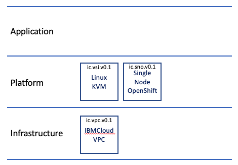
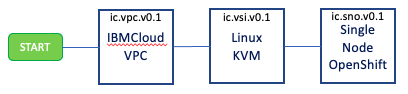

# Spin up a Single Node OpenShift Cluster With One Command

In this tutorial we will be using an Ansible playbook to automate the creation of a small production-ready single node OpenShift cluster. For the installation, we will be utilizing the new Red Hat Assisted Installer to manage the installation of OpenShift and make the process a much easier. This single node OpenShift instance is one of the smallest production ready instances of OpenShift that can be deployed to resource constrained environments for demos, Proof of Concepts, or even edge deployments on-prem. Single node OpenShift is also ideal for running workloads close to the factory floor where time sensitive decisions need to be made without the latency of communicating to the cloud. Although this tutorial deploys to IBM Cloud, many of these playbooks can be reused for on-prem deployments by targeting a local virtual or bare metal machine instead of one on IBM Cloud. Likewise, this tutorial can also be replicated to infrastructure on other cloud platforms such as Microsoft Azure or AWS.

## Prerequisites:
- IBM Cloud Account with a Pay-as-you-go subscription
- [Red Hat Account](https://sso.redhat.com/auth/realms/redhat-external/protocol/openid-connect/registrations?client_id=https%3A%2F%2Fwww.redhat.com%2Fwapps%2Fugc-oidc&redirect_uri=https%3A%2F%2Fwww.redhat.com%2Fwapps%2Fugc%2Fprotected%2Faccount.html&response_type=code&scope=openid)
- Ansible 2.9
- Basic knowledge of Ansible is helpful but not required
- [IBM Cloud CLI](https://cloud.ibm.com/docs/cli?topic=cli-install-ibmcloud-cli) 

## Time required
- This tutorial will take 1-2 hours to complete.


## Overview
If you haven't used Ansible before, you can think of it as a tool that allows you to write automation scripts in the form of yaml files called *playbooks*. What makes Ansible so powerful compared to writing bash scripts is the rich set of collections available via Ansible Galaxy that allow you to perform provisioning and configuration tasks with ease. These collections include moodules that make it easy to integrate with other tools and even provision infrastructure on public clouds. For the playbooks in this tutorial, we will be using the IBM Cloud collection to configure the resources on IBM Cloud. 

This tutorial contains a collection of Ansible playbooks that provisions a Single Node OpenShift cluster on Linux KVM on IBM Cloud using Red Hat Assisted Service. This approach of using Ansible playbooks along with the Red Hat Assisted Installer greatly reduces the time to install OpenShift and makes the installation process more user friendly because of the new Assisted Installer console that shows the progress of the installation. 

The playbooks are bundled into the following modules:

* ic.vpc.v0.1 - Infrastructure Privisioning
    * (IBM Cloud, VPC Infrastructure, v0.1)
* ic.vsi.v0.1 - Virtualization 
    * (IBM Cloud, Virtual Server Instance (VSI) with Linux KVM, v0.1)
* ic.sno.v0.1 - Single Node OpenShift Installation
    * (IBM Cloud, Single Node OpenShift (SNO), v0.1)



   <sup><sup>Figure 1. Ansible Playbooks included</sup></sup>

In detail the modules provision the following resources on IBM Cloud:

* VPC Infrastructure (Network), including:

    * Virtual Private Cloud (VPC),
    * Subnet,
    * Floating IP,
    * Access Control List (ACL),
    * Security Group

* Compute, including:

    * Virtual Server Instance (VSI) running Linux KVM,
    * SSH Key,

* A KVM guest user for the OpenShift Single Node Cluster on that VSI

* Another KVM guest user running Fedora 34 that provides DNS and DHCP services for the OpenShift Single Node Cluster KVM guest during installation,

* HAProxy on the KVM VSI to route inbound traffic to the OpenShift cluster running on the private KVM NAT network,

* Single Node Openshift (SNO) cluster. The playbooks use Red Hat's [Assisted Installer service](https://github.com/openshift/assisted-service/tree/master/docs/user-guide) to install OpenShift.

<!-- You can create a workflow to provision resources using the AWX Project or Ansible Tower.

  

   <sup><sup>Figure 2. AWX workflow example</sup></sup> -->

Having provisioned the above resources results in the following architecture.

  
   <sup><sup>Figure 3. Architecture</sup></sup>

Running the master playbook to install the  OpenShift Single Node cluster can be done with a single command but there are some prerequisites that must be in place before running that command.

# Steps:

## 1. Clone this repo

From a terminal window, clone this Github repo to your local system.

```bash
git clone https://github.com/IBM/sno-on-ibm-cloud-vpc-ansible.git
```

Go to the **ansible** sub-folder of the cloned repos root folder. **Note:** All subsequent command line instructions assume that you will be in this folder.

```bash
cd sno-on-ibm-cloud-vpc-ansible
export HOME_DIR=$(pwd)
cd ansible
```

## 2. Setup Local Machine

### 2.1 Install Ansible 2.9

The playbooks have only  been tested with Ansible 2.9 (the Red Hat supported version) so it is recommended to use 2.9 to avoid potential incompatibilities  with other versions.

The following table shows the install process for various Operating Systems:

| OS Family | Commands |
| --- | --- |
| RHEL/CentOS/Fedora/Rocky |  `dnf install epel-release`<br/>`dnf update`<br/>`dnf install ansible` |
| Ubuntu/Debian | `sudo apt update`<br/>`sudo apt install software-properties-common`<br/>`sudo apt-add-repository --yes --update ppa:ansible/ansible`<br/>`sudo apt install ansible-2.9`|
| MacOS | `brew install ansible@2.9` |
| Windows | TBD |

### 2.2 Install required Ansible collections

Run the following commands:

```bash
ansible-galaxy collection install ibm.cloudcollection
ansible-galaxy collection install community.libvirt
```

### 2.3 Install jq

The jq utility is required to parse curl commands in the complete_sno_install step. The installation was tested with jq version 1.6.

| OS Family | Commands |
| --- | --- |
| RHEL/CentOS/Fedora/Rocky |  `dnf install jq` |
| Ubuntu/Debian | `sudo apt install jq`|
| MacOS | `brew install jq@1.6` |
| Windows | TBD |

## 3. Get required credentials

The following table lists the  credentials required by the playbooks.

| Credential | How to obtain |
| --- | --- |
| IBM Cloud API Key | See instructions [here](https://cloud.ibm.com/docs/account?topic=account-userapikey&interface=ui). Download the API key as a file  or copy the value to your clipboard and paste it into a local file.|
| OpenShift pull secret | If you don't have a Red Hat subscription for OpenShift, you can get a free Developer one [here](https://developers.redhat.com/articles/faqs-no-cost-red-hat-enterprise-linux).<br/> Once you have a subscription, download the pull secret [here](https://console.redhat.com/openshift/install/pull-secret). Note: make sure you use the `Download` option and not the `copy` option. The `copy` option removes the double quotes, which will be considered invalid JSON and cause the playbooks to fail. |
| OpenShift Cluster Manager API Token | Copy the secret from [here](https://console.redhat.com/openshift/token/show). Save it in a local file called `token.txt`.|
---

---
**Optionally**: You can choose to create an IBM Cloud apikey via the IBM Cloud cli instead of through the UI as linked above.

Once logged into your IBM Cloud account, you can create a new IBM Cloud apikey as follows:

```bash
export IC_API_KEY_NAME="IBM Cloud SNO"
ibmcloud iam api-key-create $IC_API_KEY_NAME -d "API key for SNO on KVM on VSI for VPC" --file $IC_API_KEY_NAME.txt
export IC_API_KEY=$(cat $IC_API_KEY_NAME.txt | jq -r '.apikey')
echo $IC_API_KEY
```
---
<!-- Create an environment variable for your OpenShift pull secret,

```bash
export RHOCP_PULLSECRET=<pull secret>
echo $RHOCP_PULLSECRET > pull-secret.txt
``` -->

## 4. Set the playbook variables

### 4.1 Environment variables

The playbooks expect your  IBM Cloud API Key to be available as an environment variable. If you created the api key from the IBM Cloud CLI in the optional section above, this will have already been done for you. If you created the the api key from the IBM Cloud website, then you will need to follow the steps below to create an environment variable. Execution will fail if this is not the  case. From the terminal window you opened in section **1.**  export the IBM Cloud API Key as follows:

```bash
export IC_API_KEY="<your api key value>"
echo $IC_API_KEY
```

You can verify that the API Key has been setup correclty by running the following ad hoc Ansible command :

```bash
ansible localhost -m ibm.cloudcollection.ibm_is_images_info -a "name=ibm-debian-11-2-minimal-amd64-1"
```

The output should look like the following:

```bash
localhost | SUCCESS => {
    "changed": false,
    "rc": 0,
    "resource": {
        "id": "2022-03-17 12:08:24.745036 +0000 UTC",
        "images": [
            {
                "architecture": "amd64",
                "checksum": "38a853cd338d8cea2b01b5b216da8d966310fc6aa3693b6cfb274522ccf6fe3e",
                "crn": "crn:v1:bluemix:public:is:us-south:a/811f8abfbd32425597dc7ba40da98fa6::image:r006-3bfa4c4f-9c9e-454b-83fb-2f473cc015bd",
                "encryption": "none",
                "encryption_key": "",
                "id": "r006-3bfa4c4f-9c9e-454b-83fb-2f473cc015bd",
                "name": "ibm-debian-11-2-minimal-amd64-1",
                "os": "debian-11-amd64",
                "source_volume": "",
                "status": "available",
                "visibility": "public"
            }
        ],
        "name": "ibm-debian-11-2-minimal-amd64-1",
        "resource_group": null,
        "visibility": null
    },
    "stderr": "",
    "stderr_lines": [],
    "stdout": "data.ibm_is_images.ansible_ibmdebian112minimalamd641: Refreshing state...\n\nWarning: Argument is deprecated\n\nThe generation field is deprecated and will be removed after couple of\nreleases\n\n\nApply complete! Resources: 0 added, 0 changed, 0 destroyed.\n",
    "stdout_lines": [
        "data.ibm_is_images.ansible_ibmdebian112minimalamd641: Refreshing state...",
        "",
        "Warning: Argument is deprecated",
        "",
        "The generation field is deprecated and will be removed after couple of",
        "releases",
        "",
        "",
        "Apply complete! Resources: 0 added, 0 changed, 0 destroyed."
    ]
}
```

### 4.2 OpenShift Pull Secret and OpenShift Cluster Manager API Token

#### 4.2.1 Pull Secret

Copy the pull secret you downloaded in section **3.** (*pull-secret.txt*) to the *ansible/auth* folder in the directory tree of your local copy of this GH repo.

```bash
mv pull-secret.txt auth/
```

#### 4.2.2 Cluster Manager API Token

Copy the API token file  you saved in section **3.** (*token.txt*) to the *ansible/auth* folder in the directory tree of your local copy of this GH repo.

```bash
mv token.txt auth/
```

#### 4.2.3 Required Playbook parameters

i. Create a copy of the file *ansible/group_vars/all.example* in the same folder, named *all*

```bash
cp group_vars/all.example group_vars/all
```

The `all` file looks as follows:

```yaml
---
name_prefix: "CHANGE_NAMEPREFIX"
zone: "CHANGE_ZONE"
region: "CHANGE_REGION"
resource_group_name: "CHANGE_RESOURCEGROUP"
sno_domain_name: "CHANGE_DOMAIN"
sno_cluster_name: "CHANGE_CLUSTERNAME"
setup_vsi_gui: true
```

ii. Edit the file  *ansible/group_vars/all* replacing all the values set to `"*****change me*****"` with valid values. The table below gives more details about the required and optional parameters.

| Parameter | Type |  Description | Required | Default Value |
| --- | --- | --- | --- | --- |
| name_prefix | String | The prefix used for all IBM Cloud resources provisioned by the playbooks. Suffixes will be added to indicate the type of resource. For example `mynameprefix-vpc` for a VPC instance  and `mynameprefix-vsi` for a Virtual Server instance etc. | Yes | None |
| region | String | Short name of IBM Cloud region where VPC resources will be created .  e.g. us-south, us-east, eu-gb, jp-tok, au-syd etc | Yes | None |
| zone | String | Short name of IBM Cloud zone with selected region . It is the region short name with a numeric suffix. e.g. us-east-2 or eu-de-1 etc | Yes | None |
| resource_group_name | String | Name of existing IBM Cloud resource group in which  VPC resources will be created. | Yes | None |
| sno_cluster_name | String | Name of OpenShift cluster to be used by the Assisted Installer API | Yes | None |
| sno_domain_name | String | Name of OpenShift cluster domain name to be used by the Assisted Installer API . The format should be a valid domain e.g. `example.com`  but it does not have to resolveable via public DNS servers | Yes | None |
| setup_vsi_gui | Boolean | When set to true, the KVM VSI will be provioned with a GUI desktop and access via VNC will be configured. If false access to the KVM VSI will be via SSH only. | No | false |
| sno_version | String | OpenShift version to install. Valid values are "4.8","4.9" and "4.10" | No | "4.10" |

To edit the *ansible/grou_vars/all* file you can open the file in a text editor of choice.

Optionally, if you are running on a Mac, you may configure *ansible/group_vars/all* by running the following commands, replacing the values in *<>* with your values.

```bash
export MY_NAMEPREFIX=<choose a name prefix>
ibmcloud is regions
export MY_REGION=<select a region name>
ibmcloud target -r $MY_REGION
ibmcloud is zones
export MY_ZONE=<select a zone in your targeted region>
export MY_RESOURCEGROUP=$MY_NAMEPREFIX-rg
echo $MY_RESOURCEGROUP

ibmcloud resource group-create $MY_RESOURCEGROUP

export MY_DOMAIN="$MY_NAMEPREFIX.cloud"
echo $MY_DOMAIN
export MY_CLUSTERNAME=<clustername, e.g. sno49kvm6cl1>

sed -i "" "s/CHANGE_NAMEPREFIX/$MY_NAMEPREFIX/g" $HOME_DIR/ansible/group_vars/all
sed -i "" "s/CHANGE_ZONE/$MY_ZONE/g" $HOME_DIR/ansible/group_vars/all
sed -i "" "s/CHANGE_REGION/$MY_REGION/" $HOME_DIR/ansible/group_vars/all
sed -i "" "s/CHANGE_RESOURCEGROUP/$MY_RESOURCEGROUP/" $HOME_DIR/ansible/group_vars/all
sed -i "" "s/CHANGE_DOMAIN/$MY_DOMAIN/" $HOME_DIR/ansible/group_vars/all
sed -i "" "s/CHANGE_CLUSTERNAME/$MY_CLUSTERNAME/" $HOME_DIR/ansible/group_vars/all
```

On Linux, use the following:

```bash
export MY_NAMEPREFIX=<choose a name prefix>
ibmcloud is regions
export MY_REGION=<select a region name>
ibmcloud target -r $MY_REGION
ibmcloud is zones
export MY_ZONE=<select a zone in your targeted region>
export MY_RESOURCEGROUP=$MY_NAMEPREFIX-rg
echo $MY_RESOURCEGROUP

ibmcloud resource group-create $MY_RESOURCEGROUP

export MY_DOMAIN="$MY_NAMEPREFIX.cloud"
echo $MY_DOMAIN
export MY_CLUSTERNAME=<clustername, e.g. sno49kvm6cl1>

sed -i "s/CHANGE_NAMEPREFIX/$MY_NAMEPREFIX/g" $HOME_DIR/ansible/group_vars/all
sed -i "s/CHANGE_ZONE/$MY_ZONE/g" $HOME_DIR/ansible/group_vars/all
sed -i "s/CHANGE_REGION/$MY_REGION/" $HOME_DIR/ansible/group_vars/all
sed -i "s/CHANGE_RESOURCEGROUP/$MY_RESOURCEGROUP/" $HOME_DIR/ansible/group_vars/all
sed -i "s/CHANGE_DOMAIN/$MY_DOMAIN/" $HOME_DIR/ansible/group_vars/all
sed -i "s/CHANGE_CLUSTERNAME/$MY_CLUSTERNAME/" $HOME_DIR/ansible/group_vars/all
```


Check the result,

```bash
cat group_vars/all
```

### 4.3 Validate the parameters

Run the following playbook to validate the parameters

```bash
ansible-playbook validate_parms.yml  
```

You should see an output message that ends with the following

```bash
TASK [Success message] *************************************************************************************************************************************************************************************
ok: [localhost] => {
    "msg": "Parameter validation successful"
}

PLAY RECAP *************************************************************************************************************************************************************************************************
localhost                  : ok=12   changed=0    unreachable=0    failed=0    skipped=0    rescued=0    ignored=0
```

## 5. Running the master playbook and monitoring progress

In our testing the end to end process takes around 30-45 minutes although your mileage may vary depnding on network speed IBM Cloud region etc.

### 5.1 Running the master playbook

Run the following command:

```bash
ansible-playbook quickstart.yml
```

While the playbook is running feel free to step away while process completes as it will take a while.

### 5.2 Monitoring progress

Progress is displayed by Ansible via the terminal. The longest task is monitoring the Assisted Installer once the install of the cluster has been kicked off. Your screen will look like the following:

  
  <sub><sub>Figure 4. Polling the Assisted Installer</sub></sub>

Login to the IBM Cloud web console and browse your VPC resources [here](https://cloud.ibm.com/vpc-ext/network/vpcs). 

Login to the Assisted Installer portal [here](https://console.redhat.com/openshift/assisted-installer/clusters) to see more granular progress updates:

i. Select the corresponding cluster

  
  <sub><sub>Figure 5. Your clusters</sub></sub>

ii. View the progress . The overall install progress is shown  at the right of the screen.

  
  <sub><sub>Figure 6. Install progress</sub></sub>
  
### 5.3 Playbook termination

When the playbook completes the install the terminal window will look like the following. **Note:** If you selected  the GUI option for the KVM host install you will get additional details about accessing the KVM Host via VNC.

  
  <sub><sub>Figure 7. Access info </sub></sub>

  With the playbook complete, you are almost ready to access the cluster. Next, we need to setup access to the cluster via terminal and OpenShift console via the browser. 

## 6. Accessing the cluster

### 6.1 Access the cluster from  your local machine

Before you try to access your cluster, make sure the installation has completed.

To access your cluster from your local machine setup you need to do the following:

1. Add the contents of the file *auth/[your cluster name].hosts* to your local  */etc/hosts* file
1. Open the file *auth/[your cluster name]-kubeadmin.json* to see your cluster credentials 
1. For browser access go to the URL https://console-openshift-console.apps.[your cluster name].[your cluster domain] and login with your cluster credentials.

    * For oc CLI acccess enter the following command,

    ```bash
    oc login api.[your cluster name].[your cluster domain]:6443 
    ```

    * Enter your your cluster credentials when prompted

1. For SSH access to the KVM Host enter the following command:

    ```bash
    ssh -i auth/[your cluster name]-local-id_rsa  kvmadmin@kvmhost.[your cluster name].[your cluster domain] 
    ```

1. For SSH access to your single OpenShift node enter the following command:

    ```bash
    ssh -i auth/[your cluster name]-remote-id_rsa  core@sno.[your cluster name].[your cluster domain] -p 8022
    ```
  
### 6.2 Access when the GUI option for the KVM host was selected

If you selected the  GUI option for the KVM host then you can access it via VNC.

1. Access the KVM host via SSH as described in section **6.1**
1. Run the following commands to set the VNC password and restart the  VNC server

    ```bash
    vncpasswd
    sudo systemctl restart vncserver@:1.service
    ```

1. Run the following command to set the kvmadmin user password

    ```bash
    sudo passwd kvmadmin
    ```

1. Connect your VNC client to:

    ```bash
    kvmadmin@kvmhost.[your cluster name].[your cluster domain]:5901
    ```

## 7. Uninstall the cluster

As long as you still have the the same *group_var/all* file that you used to install the cluster,  you can remove the cluster and all it's components by running the following command:

```bash
ansible-playbook teardown_kvm_host.yml
```

## Troubleshooting

### Timeout

A timeout failure may occur on some tasks depending on the latency of the network or time certain processes take.

```bash
TASK [create_sno_vm : Wait for VM to become reachable over SSH] **************************************************************************************************************************
fatal: [1.2.3.4]: FAILED! => {"changed": false, "elapsed": 190, "msg": "Timeout when waiting for 192.168.122.3:22"}
```

Solution: increase the timeout value in the relevant task, e.g. `Wait for VM to become reachable over SSH` in the relevant playbook, e.g. `create_sno_vm`.

```yaml
- name: Wait for VM to become reachable over SSH
  wait_for:
    host: "{{ sno_ip_address }}"
    port: 22
    delay: 20
    **timeout: 360**
    sleep: 10
    state: started
```

## Summary

In this tutorial we went through the process of deploying your own single node OpenShift cluster on IBM Cloud using the new Red Hat Assisted Installer tool. We leveraged Ansible through a series of playbooks to automate the creation of the infrastructure on IBM Cloud and cluster installation with Assisted Installer.

## Next Steps

Now that you have an understanding of how the OpenShift installation process works, you can look to extend the process even further by adding additional playbooks for things such as operator installs, cluster admin tasks, and even deploying applications to the newly created cluster. To make this solution more repeatable and enterprise ready you can import these playbooks into AWX or Ansible Automation Controller which would offer a management console for playbook runs as well as exposing an API that would allow you to integrate AWX workflows into existing systems or even creating a front end for a cluster provisioning process.  