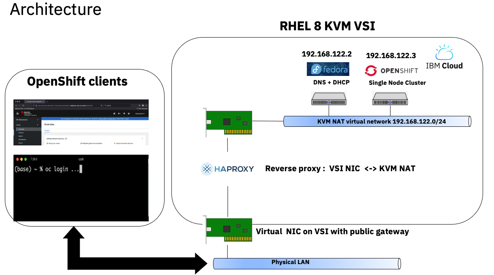
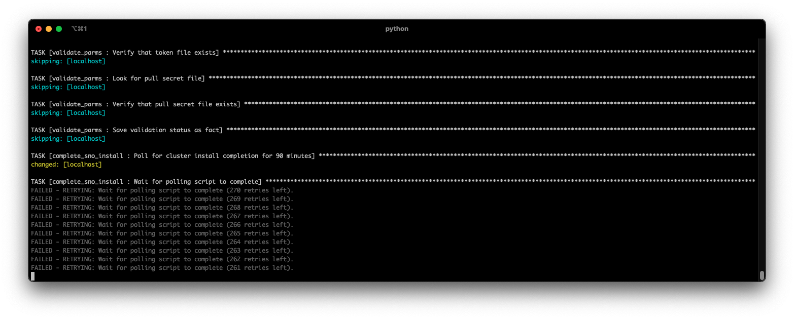
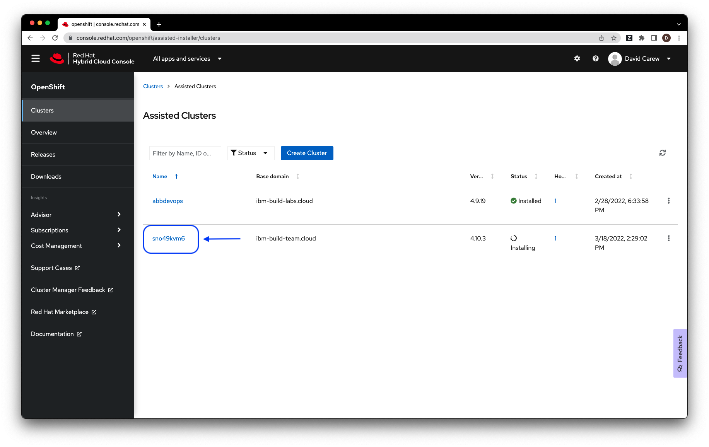
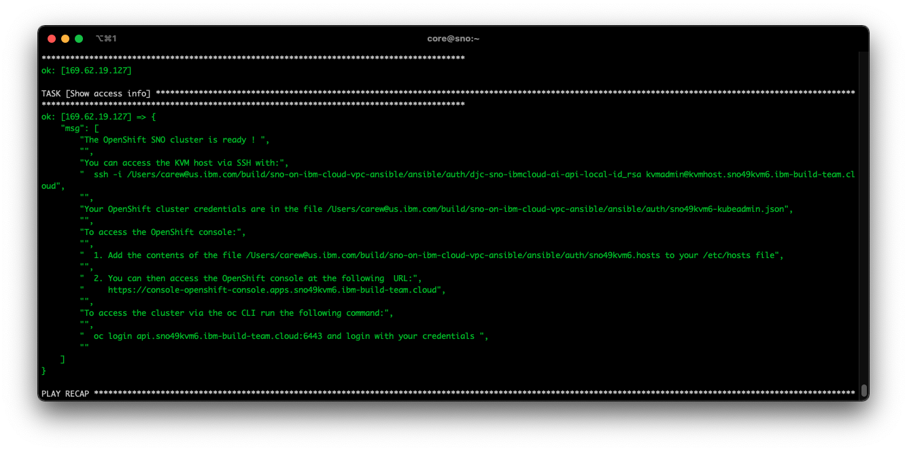

# Spin up a Single Node OpenShift Cluster on IBM Cloud

This is a set of Ansible playbooks that allow you to spin up an Single Node Openshift Cluster on IBM Cloud VPC by running a single master Ansible playbook.  The playbooks  provision the required IBM Cloud resources  and  make use of Red Hat's [Assisted Installer service](https://github.com/openshift/assisted-service/tree/master/docs/user-guide) to automate the installation of the Single Node Cluster. The following are provisoned by the playbooks:

* A single Linux based VPC VSI running KVM with all the other required IBM Cloud components (a VPC instance, subnets, security groups, ssh keys etc)

* A KVM guest for the OpenShift Single Node Cluster on that VSI

* Another  KVM guest running Fedora 34 that provides DNS and DHCP services for the OpenShift Single Node Cluster KVM guest

* HAProxy on the  KVM VSI  to route inbound traffid to the OpenShift cluster running on the private KVM NAT network

  
   <sup><sup>Figure 1. Architecture</sup></sup>
    
Running the master playbook to install the  OpenShift Single Node Cluster can be done with a single command but there are some prerequisites that must be in place  before running that command.

## 1. Clone this repo

From a terminal window, clone this Github repo to your local system.

```
   git clone <repo_url>
   
```

Go to the **ansible** sub-folder of the cloned repos root folder. **Note:** All subsequent command line instructions assume that you will be in this folder.

```
  cd sno-on-ibm-cloud-vpc-ansible/ansible

```

## 2. Setup Local Machine

### 2.1 Install Ansible 2.9

The playbooks have only  been tested with Ansible 2.9 (the Red Hat supported version) so it is recommended to use 2.9 to avoid potential incompatibilities  with other versions.

The following table shows the install process for various Operating Systems:

| OS Family | Commands |
| --- | --- |
| RHEL/CentOS/Fedora/Rocky |  `dnf install epel-release`<br/>`dnf update`<br/>`dnf install ansible` |
| Ubuntu/Debian | `sudo apt update`<br/>`sudo apt install software-properties-common`<br/>`sudo apt-add-repository --yes --update ppa:ansible/ansible`<br/>`sudo apt install ansible-2.9`|
| MacOS | `brew install ansible@2.9` |
| Windows | TBD |

### 2.2 Install required Ansible collections

Run the following commands:

``` 
    ansible-galaxy collection install ibm.cloudcollection

    ansible-galaxy collection install community.libvirt
```

### 2.3 Install jq

The jq utility is required to parse curl commands in the complete_sno_install step.

| OS Family | Commands |
| --- | --- |
| RHEL/CentOS/Fedora/Rocky |  `dnf install jq` |
| Ubuntu/Debian | `sudo apt install jq`|
| MacOS | `brew install jq` |
| Windows | TBD |

## 3. Get required credentials

The following table lists the  credentials required by the playbooks.

| Credential | How to obtain |
| --- | --- |
| IBM Cloud API Key | See instructions [here](https://cloud.ibm.com/docs/account?topic=account-userapikey&interface=ui). Download the API key as a file  or copy the value to your clipboard and paste it into a local file.|
| OpenShift Pull Secret | If you don't have a Red Hat subscription for OpenShift, you can get a free Developer one [here](https://developers.redhat.com/articles/faqs-no-cost-red-hat-enterprise-linux).<br/> Once you have a subscription, download the pull secret [here](https://console.redhat.com/openshift/install/pull-secret).|
| OpenShift Cluster Manager API Token | Copy the secret from [here](https://console.redhat.com/openshift/token/show). Save it in a local file called `token.txt`.|

##  4 Set the playbook variables

### 4.1 Environment variables

The playbooks expect your  IBM Cloud API Key to be available as an environment variable. Execution will fail if this is not the  case. From the terminal window you opened in section **1.**  export the IBM Cloud API Key as follows:

```
   export IC_API_KEY="<your api key value>"
```

You can verify that the API Key has been setup correclty by running the following ad hoc Ansible command :

```
  ansible localhost -m ibm.cloudcollection.ibm_is_images_info -a "name=ibm-debian-11-2-minimal-amd64-1"

```

The output should look like the following:

```
localhost | SUCCESS => {
    "changed": false,
    "rc": 0,
    "resource": {
        "id": "2022-03-17 12:08:24.745036 +0000 UTC",
        "images": [
            {
                "architecture": "amd64",
                "checksum": "38a853cd338d8cea2b01b5b216da8d966310fc6aa3693b6cfb274522ccf6fe3e",
                "crn": "crn:v1:bluemix:public:is:us-south:a/811f8abfbd32425597dc7ba40da98fa6::image:r006-3bfa4c4f-9c9e-454b-83fb-2f473cc015bd",
                "encryption": "none",
                "encryption_key": "",
                "id": "r006-3bfa4c4f-9c9e-454b-83fb-2f473cc015bd",
                "name": "ibm-debian-11-2-minimal-amd64-1",
                "os": "debian-11-amd64",
                "source_volume": "",
                "status": "available",
                "visibility": "public"
            }
        ],
        "name": "ibm-debian-11-2-minimal-amd64-1",
        "resource_group": null,
        "visibility": null
    },
    "stderr": "",
    "stderr_lines": [],
    "stdout": "data.ibm_is_images.ansible_ibmdebian112minimalamd641: Refreshing state...\n\nWarning: Argument is deprecated\n\nThe generation field is deprecated and will be removed after couple of\nreleases\n\n\nApply complete! Resources: 0 added, 0 changed, 0 destroyed.\n",
    "stdout_lines": [
        "data.ibm_is_images.ansible_ibmdebian112minimalamd641: Refreshing state...",
        "",
        "Warning: Argument is deprecated",
        "",
        "The generation field is deprecated and will be removed after couple of",
        "releases",
        "",
        "",
        "Apply complete! Resources: 0 added, 0 changed, 0 destroyed."
    ]
}
```

### 4.2 OpenShift Pull Secret and OpenShift Cluster Manager API Token

#### 4.2.1 Pull Secret

Copy the pull secret you downloaded in section **3.** (*pull-secret.txt*) to the *ansible/auth* folder in the directory tree of your local copy of this GH repo. 

#### 4.2.2 Cluster Manager API Token

Copy the API token file  you saved in section **3.** (*token.txt*) to the *ansible/auth* folder in the directory tree of your local copy of this GH repo. 

#### 4.2.3 Required Playbook parameters

i. Create a copy of the  the file *ansible/group_vars/all.example*  in  the directory tree of your local copy of this GH repo. The copy should be in the same folder and named *all*

ii. Edit the file  *ansible/group_vars/all* replacing all the values set to `"*****change me*****"` with valid values. The table below gives more details about the required and optional parameters.

| Parameter | Type |  Description | Required | Default Value |
| --- | --- | --- | --- | --- |
| name_prefix | String | The prefix used for all IBM Cloud resources provisioned by the playbooks. Suffixes will be added to indicate the type of resource. For example `mynameprefix-vpc` for a VPC instance  and `mynameprefix-vsi` for a Virtual Server instance etc. | Yes | None |
| region | String | Short name of IBM Cloud region where VPC resources will be created .  e.g. us-south, us-east, eu-gb, jp-tok, au-syd etc | Yes | None |
| zone | String | Short name of IBM Cloud zone with selected region . It is the region short name with a numeric suffix. e.g. us-east-2 or eu-de-1 etc | Yes | None |
| resource_group_name | String | Name of existing IBM Cloud resource group in which  VPC resources will be created. | Yes | None |
| sno_cluster_name | String | Name of OpenShift cluster to be used by the Assisted Installer API | Yes | None |
| sno_domain_name | String | Name of OpenShift cluster domain name to be used by the Assisted Installer API . The format should be a valid domain e.g. `example.com`  but it does not have to resolveable via public DNS servers | Yes | None |
| setup_vsi_gui | Boolean | When set to true, the KVM VSI will be provioned with a GUI desktop and access via VNC will be configured. If false access to the KVM VSI will be via SSH only. | No | false |
| sno_version | String | OpenShift version to install. Valid values are "4.8","4.9" and "4.10" | No | "4.10" |

### 4.3 Validate the parameters

Run the following playbook to validate the parameters

```
  ansible-playbook validate_parms.yml
  
```
You should see an output message that ends with the following
```
TASK [Success message] *************************************************************************************************************************************************************************************
ok: [localhost] => {
    "msg": "Parameter validation successful"
}

PLAY RECAP *************************************************************************************************************************************************************************************************
localhost                  : ok=12   changed=0    unreachable=0    failed=0    skipped=0    rescued=0    ignored=0
```

## 5. Running the master playbook and monitoring progress

In our testing the end to end process takes around 30-45 minutes although your mileage may vary depnding on network speed IBM Cloud region etc.

### 5.1 Running the master playbook

Run the following command:

```
ansible-playbook quickstart.yml

```

### 5.2 Monitoring progress

Progress is displayed by Ansible via the terminal. The longest task is monitoring the Assited Installer once the  install of the  cluster has kicked off. Your screen will look like the following:

  
  <sub><sub>Figure 2. Polling the Assisted Installer</sub></sub>

Login to the Assisted Installer portal [here](https://console.redhat.com/openshift/assisted-installer/clusters) to see more granular progress updates:

i. Select the corresponding cluster

  
  <sub><sub>Figure 3. Your clusters</sub></sub>

ii. View the progress . The overall install progress is shown  at the right of the screen.

  
  <sub><sub>Figure 4. Install progress</sub></sub>
  
### 5.3 Playbook termination

When the playbook completes the install the terminal window will look like the following. **Note:** If you selected  the GUI option for the KVM host install you will get additional details about accessing the KVM Host via VNC.
  
  
  <sub><sub> Figure 5. Access info </sub></sub>

## 6. Accessing the cluster

### 6.1 Access the cluster from  your local machine 
To access your cluster from your local machine  setup you need to do the following:

i. Add the contents of the file *auth/[your cluster name].hosts* to your local  */etc/hosts* file

ii. Open the file *auth/[your cluster name]-kubeadmin.json* to see your cluster credentials 

iii. For browser access go to the URL https://console-openshift-console.apps.[your cluster name].[your cluster domain] and login with your cluster credentials

     For oc CLI acccess enter the following command 
     ```
       oc login api.[your cluster name].[your cluster domain]:6443 
     ```

     Enter your your cluster credentials when prompted

iv. For SSH access to the KVM Host enter the following command:

   ```
     ssh -i auth/[your cluster name]-local-id_rsa  kvmadmin@kvmhost.[your cluster name].[your cluster domain] 
   ```
v. For SSH access to your single OpenShift node enter the following command:

   ```
     ssh -i auth/[your cluster name]-remote-id_rsa  core@sno.[your cluster name].[your cluster domain] -p 8022
   ```
  
### 6.2 Access when the GUI option for the KVM host was selected

If you selected the  GUI option for the KVM host then you can access it via VNC.

i. Access the KVM host via SSH as described in section **6.1**

ii. Run the following commands to set the VNC password and restart the  VNC server

   ```
     vncpasswd
     sudo systemctl restart vncserver@:1.service
   ```
iii. Run the following command to set the kvmadmin user password

   ```
     sudo passwd kvmadmin
   ```

iv. Connect your VNC client to:

```
   kvmadmin@kvmhost.[your cluster name].[your cluster domain]:5901
```

## 7. Uninstall the cluster

AS long as you still have the the same *group_var/all* file that you used to install the cluster,  you can remove the cluster and all it's components by running the following command:

``` 
  ansible-playbook teardown_km_.yml
```